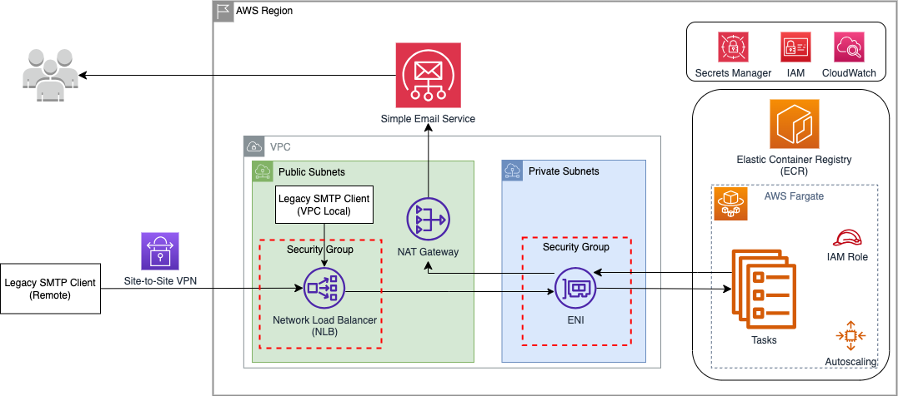

# SES SMTP Relay using AWS Fargate

## Introduction

This repository contains a sample application to build a resilient and highly-available Postfix [Amazon Simple Email Service (SES)](https://docs.aws.amazon.com/ses/latest/dg/Welcome.html) relay on AWS. Amazon SES is an email platform that provides an easy, cost-effective way to send and receive email using your own email addresses and domains.

## Prerequisites

- [AWS account](https://aws.amazon.com/premiumsupport/knowledge-center/create-and-activate-aws-account/)
- [Node.js](https://nodejs.org/en/download/)
- [Python3](https://www.python.org/) and [PIP](https://pypi.org/project/pip/)
- [AWS CDK v2](https://docs.aws.amazon.com/cdk/v2/guide/getting_started.html#getting_started_prerequisites)

## Architecture



The sample uses the AWS Cloud Development Kit (CDK) to automate deployment of resources. The stack leverages Amazon Elastic Container Service (ECS) deployed on AWS Fargate to run containers without having to manage servers. The following resources are provisioned:

1. Network Layer: VPC, Subnets, Network Load Balancer, NAT Gateway
2. Amazon ECS Cluster, Fargate Tasks

## Amazon SES Setup 

Before using Amazon SES, certain tasks must be completed including setting up the SES account, and obtaining SES credentials.

Follow the instructions [here](https://docs.aws.amazon.com/ses/latest/dg/setting-up.html#quick-start-verify-email-addresses) to set up your SES account.

You need Amazon SES SMTP credentials to access the SES SMTP interface. Follow the instructions [here](https://docs.aws.amazon.com/ses/latest/dg/smtp-credentials.html) to obtain SMTP credentials. We will store the credentials securely in AWS Secrets Manager.

**Note:** Security is a shared responsibility between AWS and you, as described in the [shared responsibility model](http://aws.amazon.com/compliance/shared-responsibility-model/). While this solution implements a number of security measures specific to Postfix and AWS Fargate tasks, it is critical to always follow [Amazon SES Email Best Practices](https://docs.aws.amazon.com/ses/latest/dg/best-practices.html) and the [Amazon SES Security Guidelines](https://docs.aws.amazon.com/ses/latest/dg/security.html) to ensure you are configuring Amazon SES appropriately to meet your security and compliance objectives.

## Store the SES secrets in AWS Secrets Manager

[AWS Secrets Manager](https://aws.amazon.com/secrets-manager/) is a secrets management service that helps you protect access to your applications, services, and IT resources. Follow the instructions [here](https://docs.aws.amazon.com/secretsmanager/latest/userguide/create_secret.html) to create a new secret (using the `"Other type of secret"` option), and populate it with two key/value pairs containing the SES credentials generated earlier. When created, your secret will look like the example below:

Secret Name: ses_smtp_secret

|Secret Key|Secret Value|
|----------|-------------|
|ses_smtp_username|AKIAEXAMPLEEXAMPLE12|
|ses_smtp_password|abcdefghijklmnopqrstuvwxyzEXAMPLEEXAMPLE1234|

**Note:** If you choose to use different names for the secret and keys - make sure to update the `cfg.py` configuration file appropriately, prior to deployment.

### Moving Out of Sandbox

To help prevent fraud and abuse, and to protect sender reputation, certain restrictions are applied to new Amazon SES accounts and all new accounts are placed in SES Sandbox. To move an account out of Sandbox and request access to Production, please follow the instructions [here](https://docs.aws.amazon.com/ses/latest/dg/request-production-access.html).

## Configuration

Configuration options are defined in `cfg.py`. They are used by CDK for deploying the application, or passed to the application container via environment variables.

| Option | Default | Description|
|--------|---------|------------|
|EXISTING_VPC|False|True/False. Set this to `True` if deploying to an existing VPC. If set to `False` - a new VPC will be created.|
|VPC_ID|vpc-1234567890abcde|VPC ID of existing VPC to deploy to. Only applies when EXISTING_VPC=True above, ignored otherwise.|
|VPC_CIDR|10.21.0.0/16|CIDR to use for a newly provisioned VPC. Only applies when EXISTING_VPC=False above, ignored otherwise|
|PUBLIC_LOAD_BALANCER|False|True/False. Configure provisioned Network Load Balancer as Internet-facing. *WARNING:* Setting this to `True` *CAN* result in an open PUBLIC relay! Use at own risk. Only use if you have also set ALLOWED_CLIENTS and ALLOWED_HELO_DOMAINS appropriately.|
|ALLOWED_CLIENTS|["10.21.0.0"]|List of IP ranges allowed to access Postfix. Used for definitions of VPC Security Groups, and the Postfix `mynetworks` configuration parameter.|
|ENABLE_HELO_DOMAIN_RESTRICTIONS|True|Allow list of domains that clients can use during the HELO/EHLO handshake, see Postfix 'smtpd_helo_restrictions' and 'check_helo_access' configuration. You can turn this feature off by setting this to `False` and and specifying an empty domain list in ALLOWED_HELO_DOMAINS| 
|ALLOWED_HELO_DOMAINS|[]|List of permitted HELO domains if ENABLE_HELO_DOMAIN_RESTRICTIONS is set to `True`.|
|TASK_CPU|1024| Integer. Task CPU (see https://docs.aws.amazon.com/AmazonECS/latest/developerguide/task_definition_parameters.html)|
|TASK_MEMORY_MIB|2048| Integer. Task Memory (see https://docs.aws.amazon.com/AmazonECS/latest/developerguide/task_definition_parameters.html)|
|TASK_COUNT|1| Integer. Minimum number of concurrent tasks|
|AUTOSCALE_MAX_TASKS|10|Integer. Maximum number of concurrent tasks|
|TASK_ENABLE_EXEC_COMMAND|False|True/False. Enable ECS Exec for ssh access to tasks for debugging (see https://docs.aws.amazon.com/AmazonECS/latest/developerguide/ecs-exec.html). |
|BUILD_PLATFORM|linux/arm64|CPU architecture of the task - "linux/arm64" for Graviton, "linux/amd64" for X86_64. See https://docs.docker.com/build/building/multi-platform/ and troubleshooting notes below if deploying to Graviton.|
|POSTFIX_SMTP_PORT|25| Port mapping for the container, it does NOT affect the Postfix default listening port. Do not change.|
|SES_SMTP_ENDPOINT|email-smtp.us-east-1.amazonaws.com| SES endpoint to use. SES endpoints are regional.|
|SES_SMTP_SECRET_ARN|arn:aws:secretsmanager:us-east-1:123456789123:secret:ses_smtp_secret-ABCEFG| ARN of the secret to get SES credentials from. Please see the SES Setup section.|
|SES_SMTP_SECRET_USERNAME_KEY|ses_smtp_username|Name of the Username key in the SES secret|
|SES_SMTP_SECRET_PASSWORD_KEY|ses_smtp_password|Name of the Password key in the SES secret|

Optionally, you can further customize the Postfix configuration by modifying the `startup-postfix` script in the docker container. 

## Deployment

Infrastructure is provisioned using AWS CDK v2. If this is the first time you are using the AWS CDK with the AWS Account - please note the section on [Bootstrapping](https://docs.aws.amazon.com/cdk/v2/guide/getting_started.html#getting_started_bootstrap).

The solution can be deployed using OSX, Linux or Windows, using appropriate versions of the prerequisite packages. Some variation in commands may be needed if you're running on OSX or Windows. Please refer to the [CDK](https://docs.aws.amazon.com/cdk/v2/guide/getting_started.html) and [CLI](https://docs.aws.amazon.com/cli/latest/userguide/cli-chap-getting-started.html) documentation and ensure your AWS profile and credentials are configured correctly prior to deployment.

Generally, the steps to deploy the solution on an [Amazon Linux 2](https://aws.amazon.com/amazon-linux-2/) based environment are:

1. Install prerequisites (see [Prerequisites](#prerequisites) section)
1. Configure your AWS profile and credentials
3. Check out the code (`git clone`, then `cd` into the top level directory)
4. Create and activate a Python virtual environment (`python3 -m venv .venv`, then `source .venv/bin/activate`)
6. Install required Python packages (`pip3 install -r requirements.txt`)
7. Configure the application (see [Configuration](#configuration) section)
5. Deploy Application (`cdk synth`, `cdk deploy`)

## Troubleshooting

1. If deploying to Graviton (BUILD_PLATFORM=linux/arm64), please ensure your Docker build environment is configured for multi-platform builds (https://docs.docker.com/build/building/multi-platform/) If you get an error similar to "Deployment failed: Error: Failed to build asset 09f2f3919be2c8897bf4013b37ca40243ac484a074651ce13af9f7ca9fbb7e4b" - try building with BUILD_PLATFORM=linux/amd64.

## Cleanup

The CDK stack can be undeployed using the `cdk destroy` command.

```
cdk destroy
```

You can also find the CloudFormation deployment with the `APP_NAME` (default is "SESRELAY") and delete the CloudFormation stack from the AWS console.

## Security

The application is set up to allow email from the list of allowed clients in the configuration file. You can add more clients to the list under `ALLOWED_CLIENTS` using CIDR notation in `cfg.py`.

HELO domain restrictions are also enabled by default. You can configure allowed domains by populating the `ALLOWED_HELO_DOMAINS` variable in `cfg.py`. 

## Cost

Running the default configuration of the solution in the us-east-1 region (N. Virginia), and using it to send 10,000 email messages per day through Amazon SES costs approximately $80 per month as of April 2023. Adjusting the size of Fargate tasks, CPU architecture used, or the number of concurrent tasks running will affect the cost of running the solution.

## License

Copyright Amazon.com, Inc. or its affiliates. All Rights Reserved.
SPDX-License-Identifier: MIT-0

See [LICENSE](LICENSE) .

## Useful CDK Commands

- `cdk ls`          list all stacks in the app
- `cdk synth`       emit the synthesized CloudFormation template
- `cdk deploy`      deploy this stack to your default AWS account/region  
- `cdk diff`        compare deployed stack with current state
- `cdk docs`        open CDK documentation